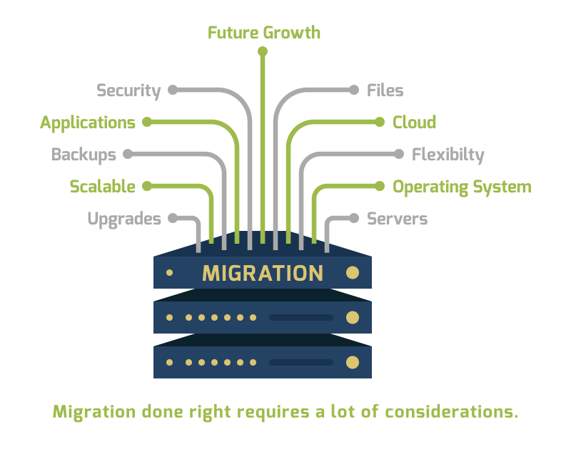

# _Migration Strategy_

Migration to new platforms can be an tiring task. While there are many benefits when moving operations off-site, issues such as stability, costs, and security can arise. 

To achieve this there are multiple solutions, tools, technologies, patterns, framework avaiable in the market. But we are going to discuss easy and the most effective way to do it with a simple
migration strategy flow.

Click the link to view the full plan:

### What is Migration?

Migration is the process of moving the system from one stack to another or from one DC to another DC or from local to Cloud and so on.

In this modern days when a company chooses to migrate then it will be mostly to cloud solutions, it’s typically thought of as moving from an on-premises or legacy infrastructure to a cloud-based infrastructure. 

#### Benefits of Cloud Migration

There are several benefits moving towards cloud:

- Scalability
- Cost
- Security
- Flexibility
- Disaster Recovery

### Migration Strategy Plan

There are quite some approach can be considered when we are planning to migrate

- Rehost
- Refactor
- Build new
- Lift and Shift

Out of 4 build new and lift/shift are the popular sort of approaches. I have explained this scenario in a flow diagram to make a effective decision.

[Migration Plan](https://app.cloudskew.com/viewer/43e723cd-2dfb-4cab-8b43-01aca8ee39c5)
